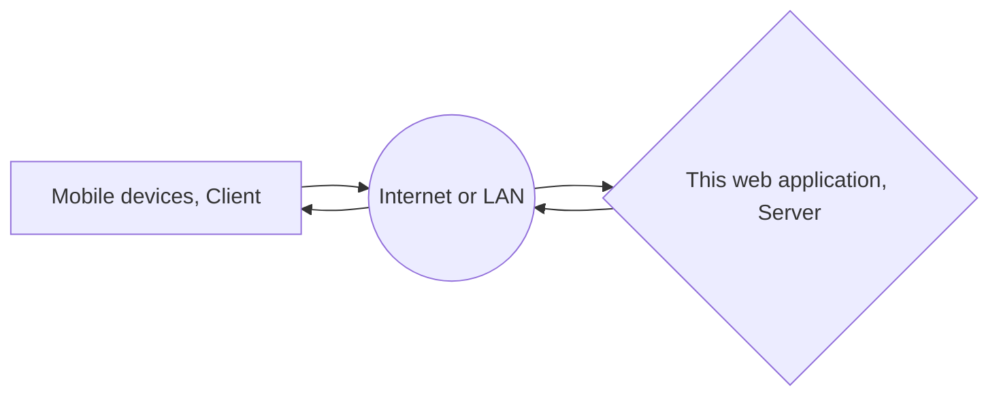

# Welcome to Remote File Explorer!

Hi! This web application can help you access your personal computer at your mobile devices. And also, if this readme is not shown properly, you can download README.html for a better read experience.

# How It Works

# How To Set Up
## 1. System Requirement
1. ANY version of Windows10
2. Python3.6 or higher
## 2. Install
1. Open CMD.
2. Run command 
> python install.py
3. Now, Installation has done.
Note: Please Don't run install.py script at IDE environment, it may casue incorrect python path setting.

## 3. Start Up
1. Just double click start_up.bat, then enjoy.

 
 # How To Use It
 1. Open up your browser.
 
 2. Let's recall what is the IP address and port of our running application. Yes, you can see it is http://192.168.64.1:8000 in this case. And let's go for it. 
 
 3. Now, we can see the login page, let's login with our username and password. Don't forget you can do settting of your username and password at config.py

 
 4. Then we can see, the home page. You can upload files in your mobile devices and go through files of your PC at remote side.
 
 
 
 
 5. Let's have a look on some different pages for different types of files.
	### 1. PDF file
	

	### 2. Picture file
	

	### 3. Music file
	

	### 4. Video file
	

	### 5. Other file
	When you try to open other types of files, it will start downloading automatically.

<!--stackedit_data:
eyJoaXN0b3J5IjpbLTU4MTU4MzQ0MCwtNTU2MTAwNzc4XX0=
-->